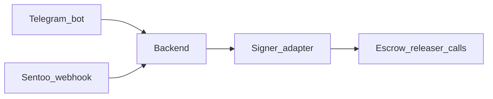

# Brainstorm: Post-Privy signer exit (KMS / cheaper infra)

**Status:** brainstorm (not scheduled)  
**Depends on:** [privy-operator-custody.md](./privy-operator-custody.md) Phase A seam  
**Related issues:** [#22](https://github.com/BreadchainCoop/curacao-crypto-onramp-bot/issues/22) (Privy bootstrap), [#23](https://github.com/BreadchainCoop/curacao-crypto-onramp-bot/issues/23) (Safe — stays regardless of signer vendor)

## Problem statement

We are bootstrapping MVP custody with a **Privy operator server wallet** so we can launch without running our own key infrastructure. That offloads MPC/enclave complexity to a vendor and keeps the product moving.

Longer term we may want to **leave paid Privy infra for the operator/releaser role** (cost, procurement, or preference for cloud KMS). This note captures the exit without blocking MVP.

**Out of scope here:** replacing Privy **user** embedded wallets. Buyers can keep Privy (or any destination address). This brainstorm is only about the **operator/releaser** signer the backend uses for `Escrow.release`.

## Desired outcome

- MVP ships with Privy operator signing (simple, robust, third-party security).
- Backend exposes a thin **signer adapter** (`signAndSendRelease` / equivalent) so swapping Privy for AWS KMS, GCP KMS, or similar does **not** rewrite the bot, Sentoo webhook, or order CAS logic.
- Safe remains escrow `owner` (Phase B); only the hot `releaser` implementation changes.

## Constraints and assumptions

- Money-path invariants in `AGENTS.md` stay: CAS transitions, Sentoo refetch, pinned `payout_wallet`, no secrets in logs.
- Raw `ADMIN_WALLET_PRIVATE_KEY` on the host is rejected for mainnet (see `SECURITY.md` item 4).
- Host compromise must not equal “full vault private key in memory” — KMS/MPC or equivalent.
- Independent escrow audit, Safe ownership, and regulatory gates remain outstanding for mainnet.

## Approaches considered

### 1. Stay on Privy operator wallet (default until exit criteria)

**Pros:** Already chosen for MVP; policies; no new infra.  
**Cons:** Vendor cost/lock-in at scale; less direct key custody control.  
**When:** Until exit criteria fire.

### 2. Cloud KMS-backed EOA releaser (AWS KMS / GCP Cloud KMS / similar)

**Pros:** Often cheaper at steady volume; keys in HSM; fits “releaser” role under Safe owner.  
**Cons:** You operate IAM, key policy, rotation, and signing code; no Privy policy engine — rely on Escrow caps + IAM.  
**When:** Signature/MAU cost or compliance prefers hyperscaler KMS.

### 3. Other MPC / wallet infra (Turnkey, Fireblocks, etc.)

**Pros:** Similar adapter swap; enterprise controls.  
**Cons:** Another vendor evaluation; may not be cheaper.  
**When:** If KMS DIY is too heavy but Privy is a poor fit.

### Rejected for this brainstorm

| Option | Why rejected (for now) |
|---|---|
| Raw key in `.env` on Render | Host = full drain; fails `SECURITY.md` |
| Phala Onchain KMS for MVP | Strong TEE story; overkill ops for bootstrap |
| Zodiac module on Safe for MVP | Deferred; Safe+role split is enough path |
| Making Telegram bot a signer again | Defeats #18 |

## Settled for MVP (from custody plan)

- Privy operator app signs; backend only.
- Bot → backend for admin ops.
- Two Privy apps (users vs operator).
- Phase B: Escrow role split + Safe before serious mainnet float.

## Exit criteria (when to schedule a swap)

Revisit replacing the Privy **operator** signer when one or more hold:

1. Monthly Privy bill (or MAU/signature tier) exceeds cost of KMS + engineering time.
2. Enterprise/compliance requires keys in a specific cloud KMS account.
3. Need signing without Privy availability/dependency.
4. Team capacity exists to own IAM, monitoring, and key rotation.

Do **not** exit solely for aesthetics if Privy is within free/cheap Developer tier and product is still validating.

## Stable seams (must survive a vendor swap)

| Layer | Stays the same |
|---|---|
| Telegram bot | No chain keys; ops via backend |
| Sentoo + order CAS | Unchanged |
| `Signer` interface | `release(to, amount)` / optional `refund` denied for hot key after Phase B |
| Escrow roles | `releaser` hot; `owner` = Safe |
| Secrets | Never log; never on bot host |

| Layer | Changes on exit |
|---|---|
| Adapter impl | `PrivyOperatorSigner` → `KmsOperatorSigner` (example) |
| Env vars | `PRIVY_OPERATOR_*` → `AWS_KMS_KEY_ID` / region / IAM role, etc. |
| Runbooks | How to rotate/disable releaser |

## Acceptance criteria for a future exit PR

- [ ] Backend tests still use a fake signer; CI never needs Privy or AWS.
- [ ] Sandbox proves `release` on testnet with the new signer.
- [ ] Privy operator credentials removed from prod env after cutover.
- [ ] Safe owner and Escrow caps unchanged; only releaser key material moves.
- [ ] `SECURITY.md` / `docs/DEPLOY.md` updated; human review on money path.

## Non-goals

- Scheduling dates or picking AWS vs GCP now.
- Migrating user embedded wallets off Privy.
- Building Phala/TEE hosting as part of MVP.
- Opening a dedicated GitHub issue until exit criteria are met (track via this doc + #14 epic).

## Hand-off

Implementation of Privy bootstrap: follow [privy-operator-custody.md](./privy-operator-custody.md).  
When exit criteria hit: open an implementation plan that replaces only the signer adapter and updates deploy/secrets docs.
