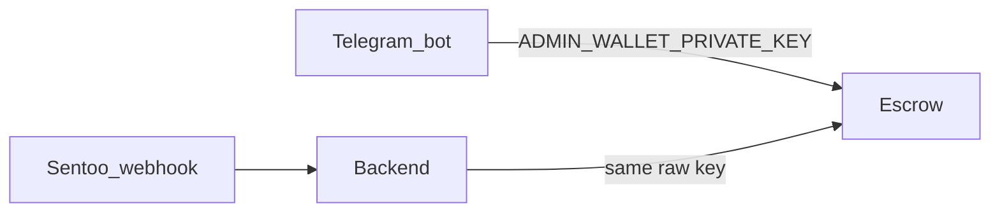
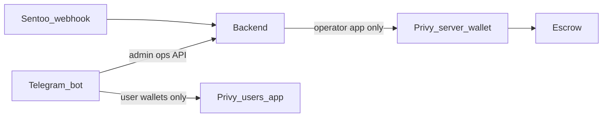
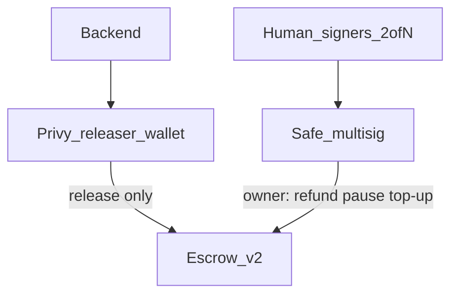

# Plan: Privy operator custody (bot → backend → Privy → Escrow)

**Status:** accepted (docs + issue rewrite; implementation not started)  
**Related issues:** [#14](https://github.com/BreadchainCoop/curacao-crypto-onramp-bot/issues/14) (epic), [#18](https://github.com/BreadchainCoop/curacao-crypto-onramp-bot/issues/18), [#21](https://github.com/BreadchainCoop/curacao-crypto-onramp-bot/issues/21), [#22](https://github.com/BreadchainCoop/curacao-crypto-onramp-bot/issues/22), [#23](https://github.com/BreadchainCoop/curacao-crypto-onramp-bot/issues/23)  
**Exit brainstorm:** [post-privy-signer-exit.md](./post-privy-signer-exit.md)  
**Audience:** humans and coding agents implementing custody changes. Read `AGENTS.md` and `SECURITY.md` before any money-path code.

## Outcome

Remove the raw escrow owner private key (`ADMIN_WALLET_PRIVATE_KEY`) from the Telegram bot and eventually from the backend runtime. The **backend** becomes the only process that requests escrow signatures. Signatures come from a **Privy operator server wallet** (MPC/enclave — the host never holds the raw escrow key). User destination wallets continue to use a **separate** Privy users app (unchanged product behavior).

Before mainnet / real fiat: Escrow gains a `releaser` / `owner` role split, and a Safe becomes `owner` with hot-float + dual-control refunds.

## Settled decisions

| Decision | Choice |
|---|---|
| Operator signer for MVP | Privy **server wallet** (operator app), not raw env key |
| Who may call Privy operator APIs | **Backend only** |
| Telegram bot + escrow | Bot never signs; admin actions call **backend ops API** |
| Privy apps | **Two apps**, one backend process: users (bot) vs operator (backend) |
| Phase A refunds | Backend-gated via Privy (admin auth); tighten with Safe in Phase B |
| Escrow role split | Yes — [#21](https://github.com/BreadchainCoop/curacao-crypto-onramp-bot/issues/21), with or before Safe |
| Safe multisig | Phase B / pre-mainnet — [#23](https://github.com/BreadchainCoop/curacao-crypto-onramp-bot/issues/23) |
| Phala / Zodiac for MVP | Out of scope (see exit brainstorm) |
| Post-Privy KMS | Documented exit only; no blocking issue |

## Architecture

### Today (unsafe for mainnet)



- Auto-`release` after Sentoo: [`backend/services/escrow.js`](../../backend/services/escrow.js) via [`backend/routes/sentoo.js`](../../backend/routes/sentoo.js).
- Admin `balance` / `refund`: [`bot/services/operator.js`](../../bot/services/operator.js) via [`bot/flows/admin.js`](../../bot/flows/admin.js).
- Key wired through [`chains.js`](../../chains.js), [`.env.example`](../../.env.example), [`render.yaml`](../../render.yaml).
- Contract: [`contracts/src/Escrow.sol`](../../contracts/src/Escrow.sol) — single `owner` may `release` and `refund`.

### Phase A target (MVP bootstrap)



1. Sentoo confirms payment → backend CAS order → backend asks Privy to sign `release(recipient, amount)`.
2. Admin taps refund in Telegram → bot calls backend → backend authz → Privy signs `refund` (Phase A only).
3. Bot continues to use the **users** Privy app for buyer wallet creation only — never operator credentials.

### Phase B target (before mainnet / real fiat)



- Escrow: `releaser` = Privy address; `owner` = Safe; pause + per-tx/daily caps (#21).
- Hot-float in escrow; bulk USDC cold; dual-control refunds (#23).

## Environments

| Layer | Privy operator? | Signer | Chain |
|---|---|---|---|
| Unit / CI (`npm test`) | No | Injected **fake** (record calls) | none |
| Local / sandbox | Yes — **dev** operator app | Real Privy server wallet | Base Sepolia |
| Production | Yes — **prod** operator app (separate credentials) | Real Privy server wallet | mainnet (after Phase B gates) |

Privy pricing is not Sepolia-specific: free Developer tier includes a large monthly signature allowance ([Privy pricing](https://www.privy.io/pricing)). Gas is separate (faucet on Sepolia; real on mainnet).

## Env vars (target shape)

Backend / Render only (operator):

```bash
PRIVY_OPERATOR_APP_ID=
PRIVY_OPERATOR_APP_SECRET=
PRIVY_OPERATOR_AUTHORIZATION_KEY=
PRIVY_OPERATOR_WALLET_ID=
# Optional toggle for local without Privy:
# ESCROW_SIGNER=fake|privy
```

Bot (users app — existing names OK):

```bash
PRIVY_APP_ID=
PRIVY_APP_SECRET=
```

Remove from bot host entirely: `ADMIN_WALLET_PRIVATE_KEY`.  
Remove from backend once Privy path is live and verified: same raw key (do not leave both enabled “just in case” in prod).

Ops API (Phase A, conceptual):

- Authenticated admin routes on backend, e.g. balance (read-only RPC OK) and refund (Privy sign).
- Bot presents the same Telegram UX; transport changes from local ethers Wallet to HTTP → backend.

## Implementation units (for coding agents)

Execute in order. Each unit should be its own PR or clearly separable commit series. **Human review required** before merge on money-path code.

### Unit A1 — Backend signer seam + Privy operator client (#22)

**Intent:** Replace raw-key signing in backend escrow service with a `signer` interface; implement Privy adapter; keep fake for tests.

**Likely files:**

- `backend/services/escrow.js` (or split `escrow.js` + `privyOperator.js`)
- `backend/index.js` / wiring
- `backend/test/*` (fake signer; no live Privy in CI)
- `.env.example`, `render.yaml`, `docs/DEPLOY.md`, `SECURITY.md` (item 4 progress note)
- `chains.js` (stop requiring `ADMIN_WALLET_PRIVATE_KEY` for backend release path)

**Acceptance:**

- [ ] Sentoo paid path still releases via CAS; tests cover success/fail/duplicate.
- [ ] No raw escrow private key required when `ESCROW_SIGNER=privy`.
- [ ] Operator Privy secrets never logged.
- [ ] Two-app rule documented: user secrets ≠ operator secrets.

### Unit A2 — Bot admin via backend ops API (#18)

**Intent:** Delete bot-side escrow Wallet; admin balance/refund call backend.

**Likely files:**

- `bot/services/operator.js`, `bot/flows/admin.js`, `bot/index.js`
- `bot/test/admin.test.js` (fake HTTP client or injected ops client)
- New `backend/routes/ops.js` (or similar) + tests
- Bot env: drop `ADMIN_WALLET_PRIVATE_KEY`

**Acceptance:**

- [ ] Admin Telegram UX unchanged (menu, confirm refund).
- [ ] Bot process has no chain signing key for escrow.
- [ ] Unauthorized callers cannot hit refund.
- [ ] Preserve refund ordering / CAS invariants from #14 Phase 0 if not already done (only `failed → refunded`, CAS before chain, no retry after chain-success + DB failure, no `err.message` leak to Telegram).

### Unit B1 — Escrow releaser / owner split (#21)

**Intent:** On-chain, Privy can only `release` (within caps); Safe/`owner` controls refund/pause/role changes.

**Likely files:**

- `contracts/src/Escrow.sol`, `contracts/test/Escrow.test.js`, deploy scripts, `contracts/DEPLOYMENTS.md`

**Acceptance:**

- [ ] `releaser` cannot `refund` or change roles.
- [ ] Per-tx and daily release caps + `pause` covered by tests.
- [ ] Redeploy path documented for testnet; mainnet deploy remains human-gated.

### Unit B2 — Safe owner + hot-float + dual-control refunds (#23)

**Intent:** Transfer escrow `owner` to Safe; operational hot-float; refunds require dual control (not a single Telegram admin + hot Privy key).

**Acceptance:**

- [ ] Safe is on-chain `owner`.
- [ ] Hot-float policy documented (max escrow balance; multisig top-ups).
- [ ] Refund path no longer sole-powered by Privy operator wallet.
- [ ] Durable audit log for privileged ops.

## Verification

**Per unit (implementation PRs):**

```bash
# Bot
cd bot && npm ci && npm test && npm run test:coverage

# Backend
cd backend && npm ci && npm test && npm run test:coverage

# Contracts (when #21 touched)
cd contracts && npm ci && npm test && npm run coverage
```

**Sandbox smoke (manual, not CI):**

1. Operator Privy wallet funded with Sepolia ETH; escrow funded with test USDC; wallet set as owner (Phase A) or releaser (Phase B).
2. Paid Sentoo sandbox payment → USDC released to pinned `orders.payout_wallet`.
3. Admin refund from Telegram → backend → Privy → chain (Phase A only).
4. Confirm bot env has no `ADMIN_WALLET_PRIVATE_KEY`.

## Non-goals

- Implementing Privy/Escrow code in the docs-only PR that introduced this file.
- Phala TEE / Zodiac modules for MVP.
- Merging user and operator Privy apps.
- Mainnet deploy or real-fiat launch without #21 + #23 + `SECURITY.md` gates.
- Changing Sentoo refetch/CAS, KYC document handling, or Supabase RLS posture.

## Prompt sketch for implementers

> Implement Unit A1 from `docs/plans/privy-operator-custody.md`: add a backend escrow signer interface with a Privy operator adapter and a test fake; wire Sentoo release through it; do not put operator secrets on the bot; keep CI offline. Follow AGENTS.md money-path invariants.

Then A2, then B1/B2 as separate reviewed changes.
